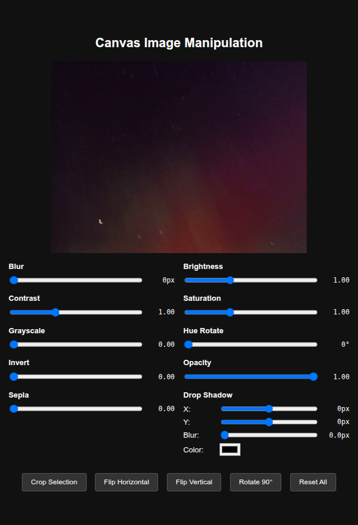

# [Canvas Image Manipulation](https://kherrick.github.io/canvas-image-manipulation/)

A web-based image editor built with HTML5 Canvas that provides real-time image manipulation capabilities. Load images and apply various filters, transformations, and cropping operations directly in your browser.

## Screenshot

## Features

### Image Filters

- **Blur**: Apply gaussian blur effect (0-10px)
- **Brightness**: Adjust image brightness (0-3x)
- **Contrast**: Modify image contrast (0-3x)
- **Saturation**: Control color saturation (0-3x)
- **Grayscale**: Convert to grayscale (0-100%)
- **Hue Rotate**: Shift color hues (0-360°)
- **Invert**: Invert image colors (0-100%)
- **Opacity**: Adjust transparency (0-100%)
- **Sepia**: Apply sepia tone effect (0-100%)

### Drop Shadow

- **X/Y Offset**: Position shadow horizontally and vertically (-20px to +20px)
- **Blur**: Control shadow blur radius (0-20px)
- **Color**: Choose custom shadow color with color picker

### Image Transformations

- **Crop Selection**: Select and crop specific regions of the image
- **Flip Horizontal**: Mirror image horizontally
- **Flip Vertical**: Mirror image vertically
- **Rotate 90°**: Rotate image in 90-degree increments
- **Reset All**: Return to original image and reset all filters

### Selection & Cropping

- **Interactive Selection**: Click and drag to select regions for cropping
- **Visual Feedback**: Yellow dashed rectangle shows selection area
- **Touch Support**: Works on mobile devices with touch gestures
- **Precise Cropping**: Maintains aspect ratio and quality during crop operations

## How to Use

1. **Load the Application**: Open the HTML file in a web browser
2. **Apply Filters**: Use the slider controls to adjust various image properties in real-time
3. **Make Selections**: Click and drag on the image to create selection rectangles
4. **Crop Images**: Click "Crop Selection" to crop to the selected area
5. **Transform Images**: Use flip and rotate buttons to transform the image
6. **Reset**: Use "Reset All" to return to the original image

## Technical Details

### Built With

- **CSS**: Modern styling with grid layout and responsive design
- **HTML Canvas**: Core image rendering and manipulation
- **JavaScript**: No external dependencies required

### Key Technical Features

- **Cross-Origin Support**: Handles images from external sources
- **Memory Efficient**: Stores only necessary image data
- **Real-time Processing**: All filters applied instantly using Canvas 2D API
- **Responsive Design**: Adapts to different screen sizes
- **Touch Optimized**: Full support for mobile touch interactions

### Browser Compatibility

- Chrome, Firefox, Safari, Edge
- Mobile browsers with touch support
- Modern browsers supporting HTML5 Canvas

## Sample Image

The application loads with a sample aurora borealis image to demonstrate capabilities. You can replace the `imageUrl` variable in the script to use your own images.

## File Structure

- Can be run locally or hosted on any web server
- No external dependencies or build process required
- Single HTML file containing all CSS and JavaScript

## Development Notes

- Handles both mouse and touch events for cross-platform compatibility
- Implements custom selection rectangle drawing
- Maintains image quality through proper scaling calculations
- Supports both filtered and cropped image states
- Uses HTML5 Canvas 2D context for all image operations
